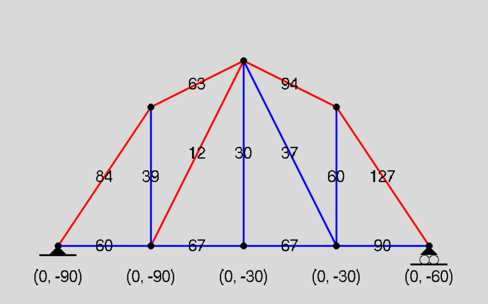

# PyTruss

Calculates internal and reaction forces in truss structure. This program can be used to check your hand calculations. It also tell you if truss structure is under or overdetermined.

## Dependencies

Requires an installation of Python as well as the numpy, and sympy packages.

## Installation

Simply download/clone this repository into your local project folder. The only required file is ```pyTruss.py```.

## Example

Import pyTruss, and create an instance of the ```Solver``` using the code below.

```python
import pyTruss as pt

solver = pt.Solver()
```

To create truss nodes, instantiate instances of the ```Node``` class. You can specify restrictions by settings the reactions parameter. By default the reactions parameter is equal to (0, 0) which indicates no reaction force at that node. reactions = (1, 0) represents a reaction force in the X direction.

To apply forces to nodes you can set the force parameter equal to a non-zero vector. For example, force = (0, -30) represents a force pointing downwards with a force of 30. Finally add the nodes to the solver using ```solver.AddNodes()```. You can also add individual nodes using ```solver.AddNode()```

```python
nodeA = pt.Node(0, 0, reactions=(0, 1))
nodeB = pt.Node(3, 3)
nodeC = pt.Node(3, 0, force = (0, -30))
nodeD = pt.Node(6, 4)
nodeE = pt.Node(6, 0, force = (0, -30))
nodeF = pt.Node(9, 3)
nodeG = pt.Node(9, 0, force = (0, -90))
nodeH = pt.Node(12, 0, reactions=(1, 1))

solver.AddNodes([nodeA, nodeB, nodeC, nodeD, nodeE, nodeF, nodeG, nodeH])
```

To specify truss members, use the ```Connection``` class. Include the two nodes that define the connection. The order is irrelevant. You can add the connection to the solver using ```solver.AddConnection()```.

```python
solver.AddConnection(pt.Connection(nodeA, nodeB))
solver.AddConnection(pt.Connection(nodeB, nodeC))
solver.AddConnection(pt.Connection(nodeA, nodeC))
solver.AddConnection(pt.Connection(nodeB, nodeD))
solver.AddConnection(pt.Connection(nodeC, nodeD))
solver.AddConnection(pt.Connection(nodeD, nodeE))
solver.AddConnection(pt.Connection(nodeC, nodeE))
solver.AddConnection(pt.Connection(nodeD, nodeG))
solver.AddConnection(pt.Connection(nodeE, nodeG))
solver.AddConnection(pt.Connection(nodeF, nodeG))
solver.AddConnection(pt.Connection(nodeD, nodeF))
solver.AddConnection(pt.Connection(nodeF, nodeH))
solver.AddConnection(pt.Connection(nodeG, nodeH))
```
Finally call Solver.Solve() to calculate the solution. You can print the solution from the solver or visualize the solution using Solver.Draw().

```python
internalForces, reactionForces = solver.Solve()
solver.Draw()
```
Red indicates members in tension and blue is for compression. An example GUI output is shown below:


